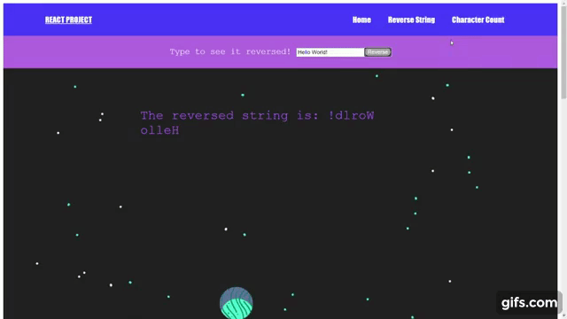

## React Project

A one-page REACT Web App that can switch between two components.

## Project Screen Shot(s)

## Installation and Setup Instructions

Clone down this repository. You will need `node` and `npm` installed globally on your machine.  

Installation:

`npm install`  

To Start Server:

`npm start`   

## Reflection

    This is a 4 day Interview React project for Ada County in Idaho. Project goals included building a single page application using React with two components: Reverse String and Character Count. 
    
    Originally I started off by creating two components and then I wanted to make the web app look nicer so I created a navigation bar using Routers that switched between routes. The projects reverse string and character count are functions I have experience with so implementing was not to difficult. 
    
    My main challenge was learning react components, but I was able to come out knowing more than I did 4 days ago.

    If I could do anything different, I would probably make one of the components a hook and also add different packages to make site look even better.

